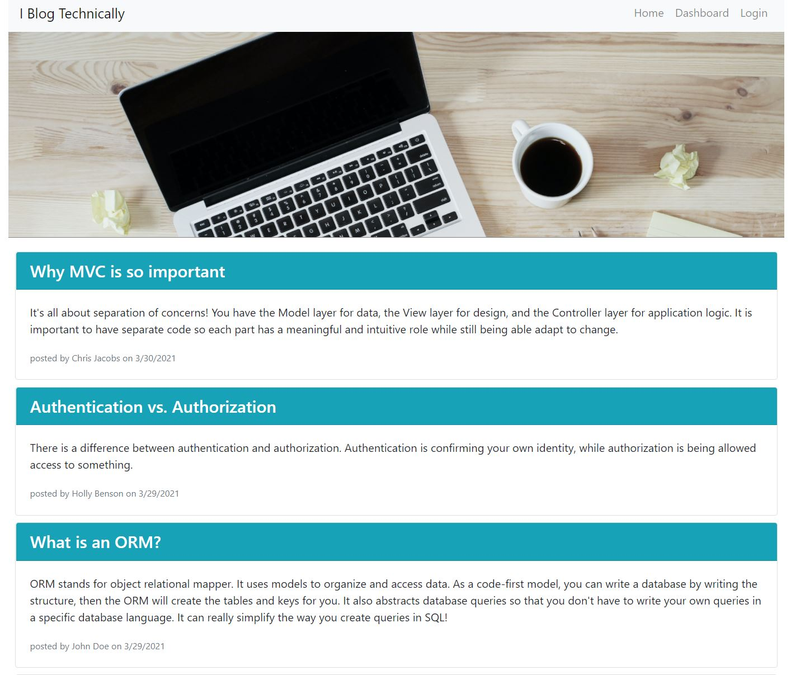
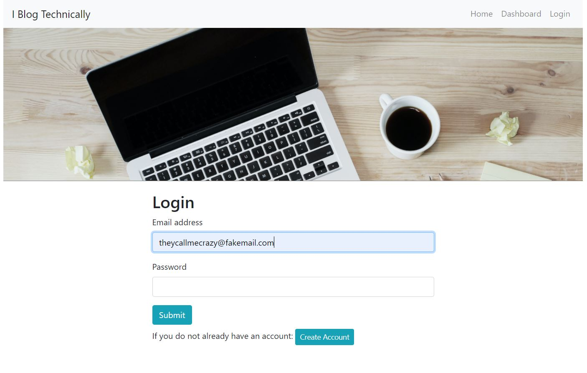
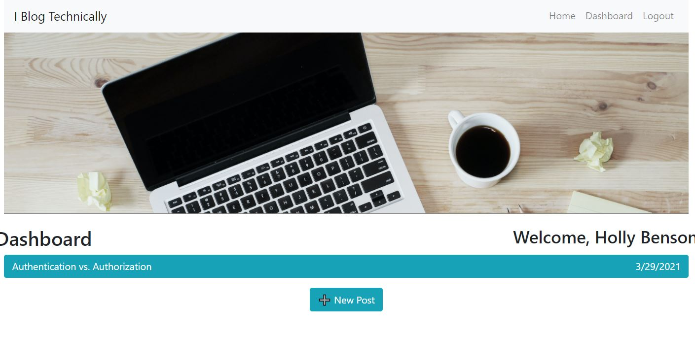
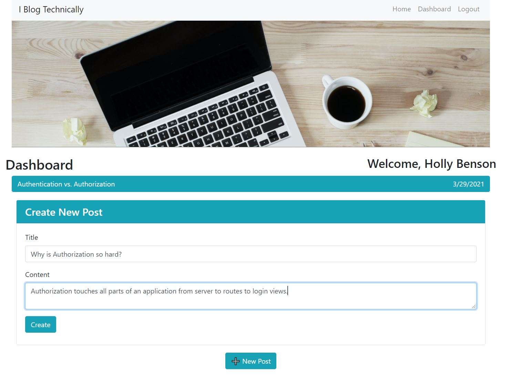
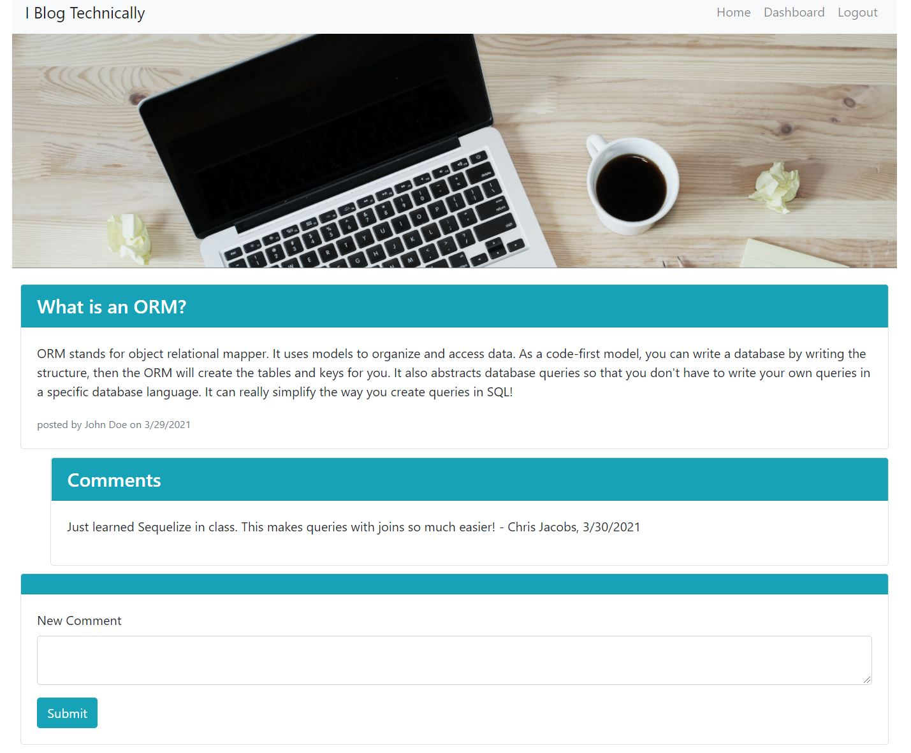
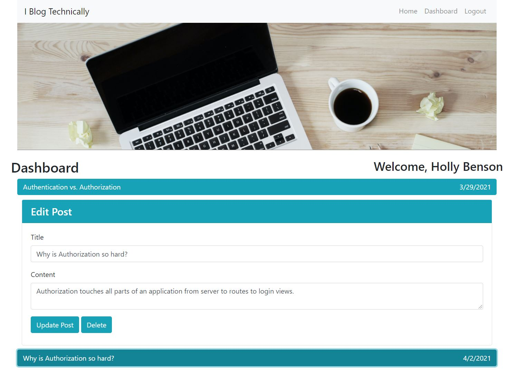

# I Blog Technically: Tech Blog

  
  
  ## Description
  [Deployed application](https://rhubarb-cobbler-10166.herokuapp.com/)
  
  This is a full stack blogging application similar to WordPress. A user can view posts from other users on the home page, and, if signed in, they can 1) view, edit, or delete their own posts, and 2) comment on other users' posts. The app uses an Express server, Sequelize database model, and Sequelize session store to persist a login state. The server and database are deployed to Heroku, so this is a fully functional application from front to back end.
  
  ## Table of Contents
  
  * [Description](#description)
  * [Installation](#installation)
  * [Usage](#usage)
  * [Tests](#tests)
  * [Contributing](#contributing)
  * [License](#license)
  * [Questions](#questions)
    
  ## Installation
  Run npm i
  
  ## Usage
  1. Visit the homepage at https://rhubarb-cobbler-10166.herokuapp.com/

  
  
  2. Create a new account

  3. Navigate to the dashboard to make new posts

  
  

  4. View all blog posts on the home page

  5. Read all comments and leave your own by clicking on individual blog posts from the home page

  

  6. Update or delete your own posts from the dashboard

  

  7. Logout when you are done
  
  

  
  ## License
  [APACHE 2.0 License](https://choosealicense.com/licenses/apache-2.0/)
  
  ## Contributing
  To contribute to this repo:
  1. Fork the repo
  1. Make changes to forked repo
  1. Submit a pull request to this repo
  

  Thank you to the following who have already contributed: Renae Sowald
  
  ## Tests
  no tests
  
  ## Questions
  
  For more information:
  Visit my GitHub: [https://rsowald.github.io](https://rsowald.github.io)

  or Email: renaesowald@gmail.com